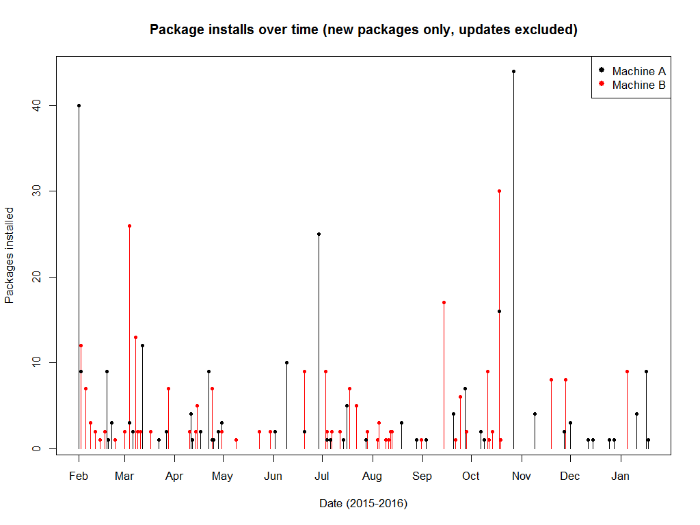

# install_frequency
Plot / analyze frequency of manual package installation on Ubuntu

To measure the frequency at which package installation is necessary on Ubuntu machines, the following steps were taken:

Get a list of installed packages *by date* with [pkginstalls.sh](https://help.ubuntu.com/community/ListInstalledPackagesByDate) 
(in case that link breaks, here's a [local copy](./pkginstalls.sh).

    bash pkginstalls.sh

creates `pkginstalls.txt`.  Then get a list of *manually* installed packages using this 
[handy answer]( http://askubuntu.com/questions/2389/generating-list-of-manually-installed-packages-and-querying-individual-packages)

    comm -23 <(aptitude search '~i !~M' -F '%p' | sed "s/ *$//" | sort -u) <(gzip -dc /var/log/installer/initial-status.gz | sed -n 's/^Package: //p' | sort -u) >del.lst

which creates del.lst. Then extract the the subset of packages with their date which were manually installed:

    grep -f del.lst pkginstalls.txt >subset.A.txt

Finally [install_freq.R](./install_freq.R) is used to make this plot:

and report these statistics:

    Min. 1st Qu.  Median    Mean 3rd Qu.    Max. 
    1.000   2.979   5.000   7.242   9.521  38.000 

on the interfal between installations (in days).

  
